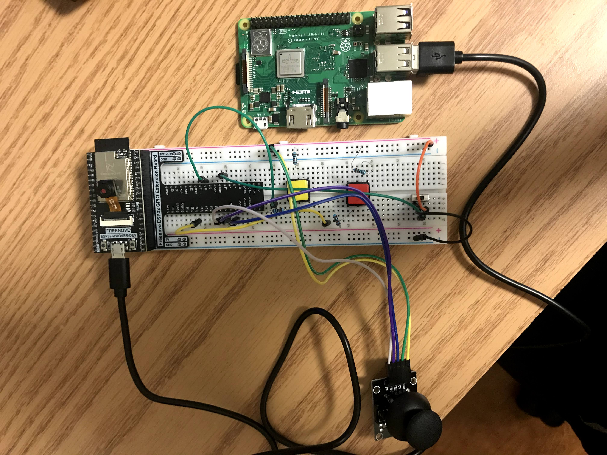
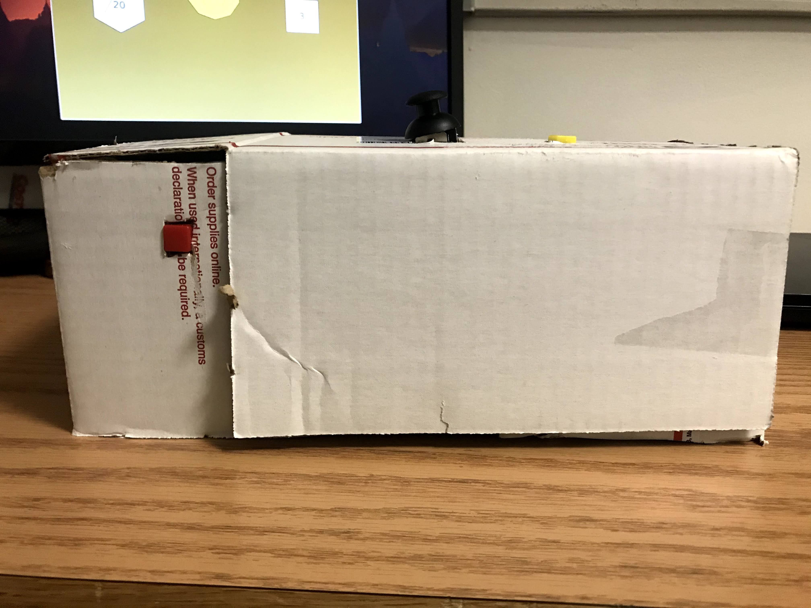
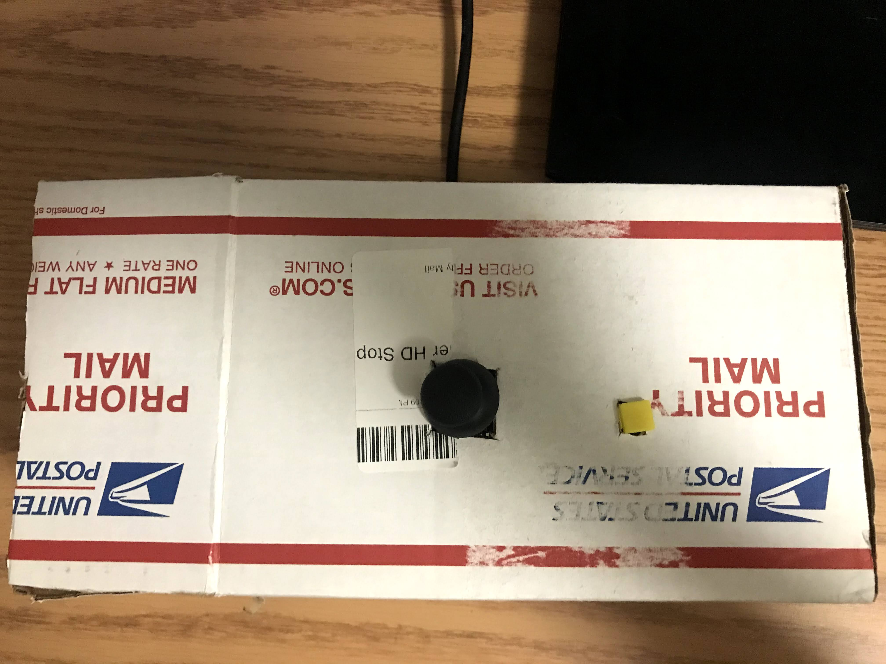
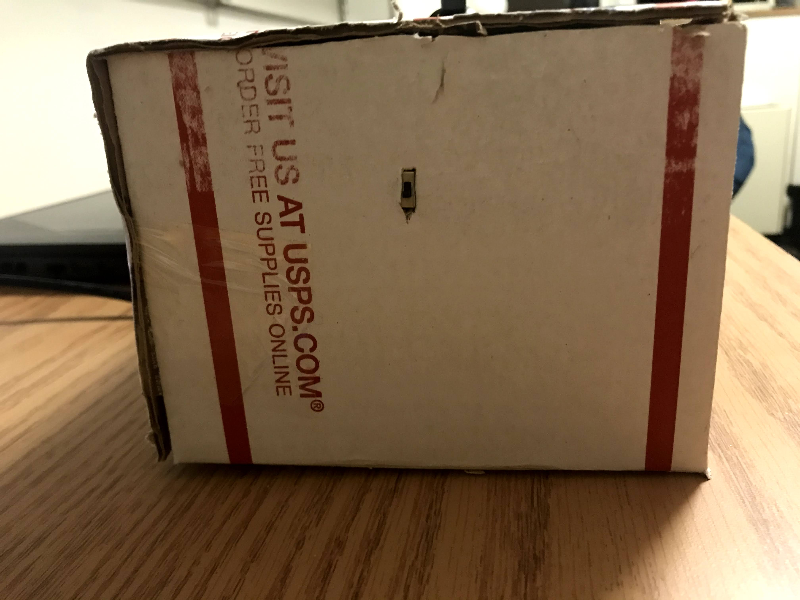
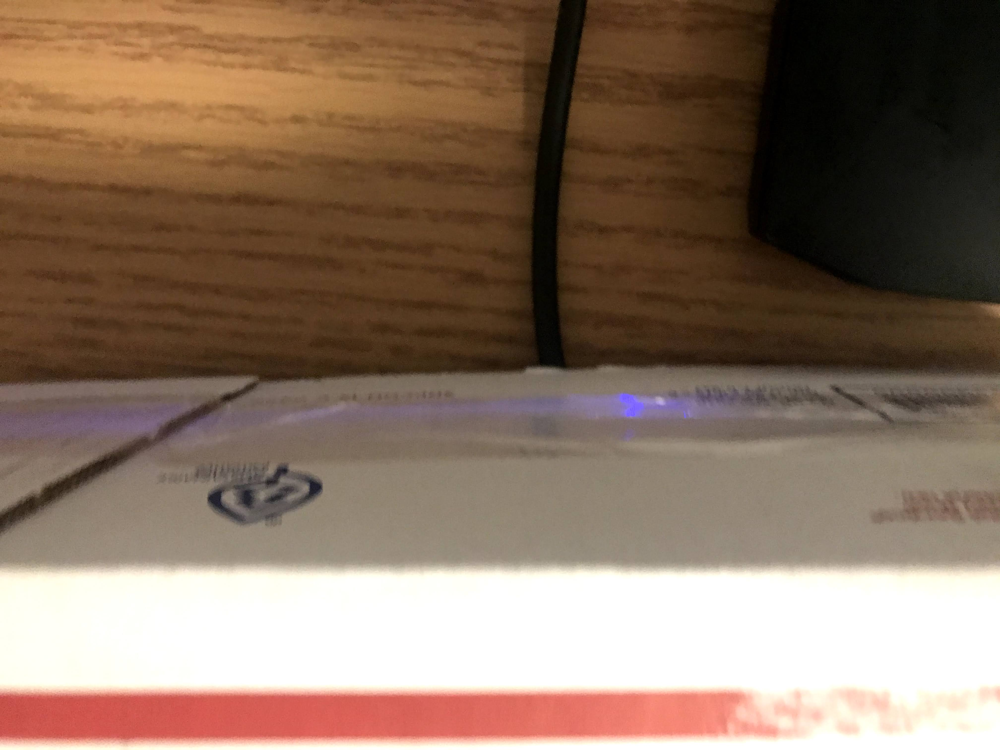

# Your Turn to Roll

This repo contains a simple arduino program, and a processing script. The arduino code should be uploaded to an ESP32 wrover module before attempting to run the processing script. To successfully run everything, you'll need a raspberry pi, an ESP32 wrover module, a monitor, a 3 axis joysick, 2 momentary buttons, and one DPST switch. When all of this is connected, you will be presented with 3 virtual dice of 20, 12, and 6 sides. Since this project is Dungeons and Dragons themed, finding the instructions is going to be an adventure of your own! 

[Video Demo](https://youtu.be/odz9Fv931Ek)
[Video with enclosure](https://youtu.be/Y-qNVOHN09M)


# Table of Contents <!-- omit in toc -->
- [Setup](#setup)
  - [Hardware](#hardware)
  - [Software](#software)
  - [Enclosure](#enclosure)
  - [Getting Started](#running)  


# Setup

## Hardware

This program requires a Raspberry Pi 3b+ running Raspbian GNU/Linux version 10+, aka buster. This also requires a monitor with an HDMI port, an ESP32 wrover module, a monitor, a 3 axis joysick, 2 momentary buttons, and one DPST switch. 

The following is the intended configuration: 



A raspberry pi is connected to the esp32, which is situated on a breadboard using the Freenove esp32 GPIO Extension Board. 
1. 3 axis Joystick
  * Connect the GRD pin to ground on the extension board. 
  * Connect the +5v pin to the 3.3v section on the extension board. 
  * Connect the VRX pin to pin 13 on the extension board. 
  * Connect the VRY pin to pin 12 on the extension board. 
  * Connect the SW pin to pin 14 on the extension board. 
2. Button one (yellow):
  * Connect the upper left prong to a 10kΩ resistor, and then connect that resistor to pin 18 on the extension board.
  * Connect the lower right prong to a 10kΩ resistor, and then connect that resistor to the 3.3v section on the extension board. 
3. Button two (red):
  * Connect the upper left prong to a 10kΩ resistor, and then connect that resistor to pin 32 on the extension board.
  * Connect the lower right prong to a 10kΩ resistor, and then connect that resistor to the 3.3v section on the extension board. 
4. DPST switch:
  * Connect the top pin to GND on the extension board. 
  * Connect the middle pin to pin 4 on the extension board. 
  * Connect the bottom pin to the 3.3v section on the extension board.  

The HDMI cable and power supply go in the HDMI port and micro-USB port, respectively. Finally, the ESP32 is to be connected to one of 4 USB ports. 

## Software 

The Arduino code, which is to be run on the esp32. It is contained within inputManagement.ino, and as the title suggests it manages the input for this device. This takes the GPIO connections in [hardware](#hardware) and recieves input, formatting them into a list of the format : Joystick X axis, Joystick Y Axis, Joystick Z axis, Button one, Button two, and switch. It then sends this information out through the serial connection to the Raspberry Pi. 

The Raspberry Pi is running a processing script, known as outputManagement.pde. This takes the input from the serial port and turns it into the Your Turn to Roll program. The X axis of the Joystick, in conjunction with the DSPT switch, controls the selected die. Depending on the direction the joystick is facing when the switch is flipped, the selected die will be switched in the same direction. The Y axis controls the vertical position of a die on the screen, and the Z axis controls whether or not instructions are visible. The first button allows the die to be "rolled", randomly selecting numbers to simulate the act of dice rolling along a table, and then finally settling on a final new, randomly selected number. The last button acts as a reset switch, allowing the program to return to its initial state at any point. 

Additionally, please install processing onto your raspberry pi. The [processing webpage](https://pi.processing.org/get-started/) has some very helpful information on that front. Alternatively, run the following command in your pi terminal:
```
curl https://processing.org/download/install-arm.sh | sudo sh
```

## Enclosure 

Since dungeons and dragons is a game about adventures, what better to build an enclosure than a box that has been around the world? Or at the very least, around the country. Since the breadboard is rather long, it was a struggle to find a box wide enough to fit it while having flat surfaces all around, and this box came in extremely handy. 






On the top, there is a joystick and the roll button, as those are the two main functonal parts of this program. Off to the left, the switch is hidden away, so one has to search to find it, and directly in the front, the reset button is visible, enticing users to press it after fooling around with the joystick. All components are hidden within, and a small slit was cut in the back to allow for insertion of the HDMI cable. 

## Getting Started

First, you must load the inputManagement script onto the esp32 module. This can be done by opening the Arduino program, compiling and uploading the code to the arduino, and being sure to hold down the boot button while this is occuring. This makes sure that the software stays on the device upon reboot. If the device returns null values, one must only click the rst button, and it should start working as intended once again. 

Once this is done, make sure to download processing on your raspberry pi via the command mentioned above. Then simply hook up all the inputs into your esp32, plug that into your rasperry pi, plug your raspberry pi into an external monitor and run the diceRoller.sh script. 